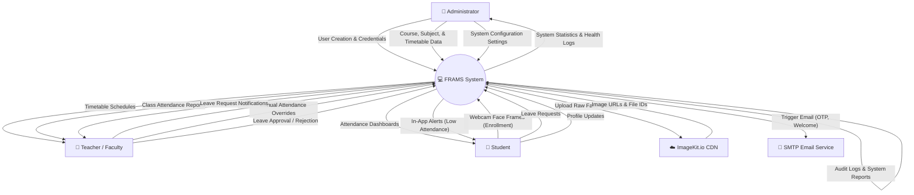
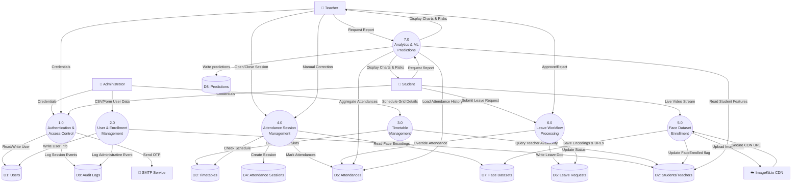
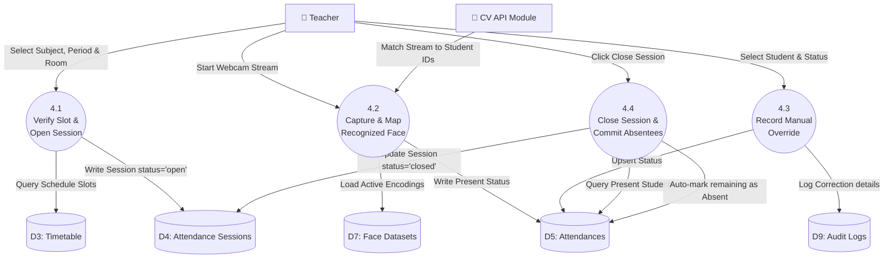
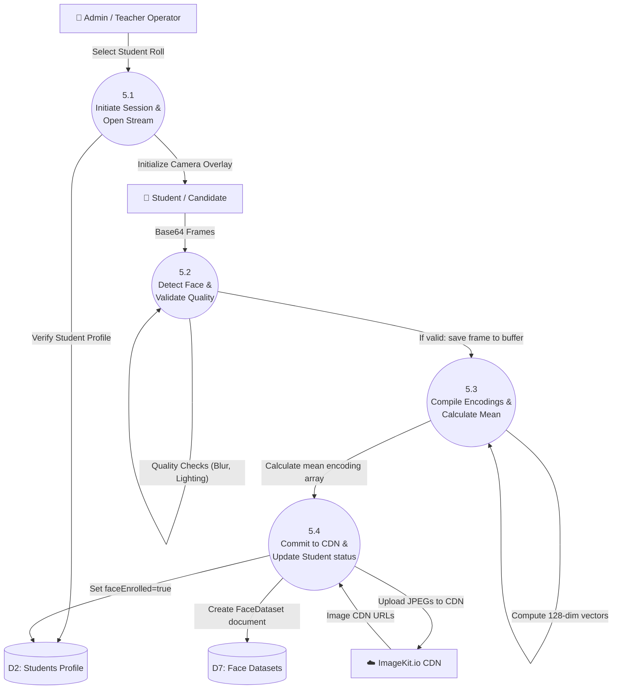

# Data Flow Diagrams (DFD)
## AI-Powered Face Recognition Attendance Management System (FRAMS)

This document provides a detailed breakdown of the data flow within the FRAMS application. It includes Level 0 (Context Diagram), Level 1 (System Decomposition), and Level 2 (Detailed Processes) diagrams using Mermaid syntax, accompanied by process descriptions, data store maps, and data flow descriptions.

---

## 1. DFD Level 0: Context Diagram

The Context Diagram defines the system boundary, showing the high-level inputs and outputs between the **FRAMS Core System** and external entities (users and cloud services).

### Entity Interactions

*   **Administrator**: Manages master configuration (users, courses, subjects, timetables, and system-wide settings) and receives consolidated logs and statistics.
*   **Teacher**: Configures and runs attendance sessions, performs manual corrections, reviews leave requests, and generates reports.
*   **Student**: Registers facial datasets, views attendance logs, submits leave requests, and receives automated low-attendance warnings.
*   **ImageKit.io CDN**: Stores face images securely and yields accessible image URLs for the face recognition pipeline.
*   **SMTP Service**: Dispatches system notifications (welcome emails, one-time passwords, and urgent attendance warnings).

---

## 2. DFD Level 1: System Decomposition

The Level 1 DFD decomposes the system into major functional modules, illustrating how data flows between processes, data stores, and external entities.

### Process Explanations

1.  **1.0 Authentication & Access Control**: Verifies user identity via JWT tokens, handles password modification, and logs access security events.
2.  **2.0 User & Enrollment Management**: Manages student and teacher directories, processes bulk CSV files, and structures department links.
3.  **3.0 Timetable Management**: Checks for scheduling collisions (teachers or rooms double-booked) and structures the weekly calendar.
4.  **4.0 Attendance Session Management**: Governs lecture-based sessions, processes automated student detections, and logs manual edits.
5.  **5.0 Face Dataset Enrollment**: Coordinates webcam frames, filters out blurred images, compiles vectors, and logs CDN assets.
6.  **6.0 Leave Workflow Processing**: Processes requests, links files, notifies educators, and updates attendance status records.
7.  **7.0 Analytics & ML Predictions**: Evaluates historical records to compute attendance percentages and runs the Random Forest model to flag students at risk of shortage.

---

## 3. DFD Level 2: Detailed Processes

This section details the sub-processes for **Process 4.0 (Attendance Session)** and **Process 5.0 (Face Dataset Enrollment & Recognition)** to show exact logic flows.

### 3.1 Process 4.0: Detailed Attendance Session Marking

This DFD shows how an attendance session is opened, how face recognition data is processed, and how records are updated.

*   **Process 4.1**: Validates that a session for the given date, time, and class section does not already exist. If unique, an `AttendanceSession` document is saved as `open`.
*   **Process 4.2**: The teacher's browser streams webcam frames. The CV API matches detected faces against stored student encodings, running liveness checks in parallel. Confirmed matches are written to the `attendances` collection.
*   **Process 4.3**: Allows the teacher to correct wrong detections, logging each change to the `audit_logs` collection.
*   **Process 4.4**: Compares the student roster against present records, writes `Absent` documents for missing students, and sets the session status to `closed`.

---

### 3.2 Process 5.0: Detailed Face Dataset Enrollment & Verification

This DFD shows the face capture loop, image validation, encoding calculation, and CDM integration.

*   **Process 5.1**: Initializes the enrollment workspace, ensuring the student profile is valid and does not have an active face dataset.
*   **Process 5.2**: Reviews video frames. The camera overlay prompts the user to rotate their head to capture multiple angles. Blurry or poorly-lit frames are rejected.
*   **Process 5.3**: Computes 128-dimensional vectors from the 100 captured frames and averages them to create a mean encoding.
*   **Process 5.4**: Uploads the raw images to ImageKit.io, links the assets in the database, sets the student's `faceEnrolled` flag to `true`, and updates the in-memory Known Faces registry.

---

## 4. Data Dictionary: Key Data Flows

The table below defines the structure and contents of key data flows represented in the DFDs.

| Data Flow Name | Source | Destination | Data Elements (Fields) | Format / Protocol |
|---|---|---|---|---|
| User Credentials | User | P1.0 | `email`, `password` | JSON / HTTPS |
| Welcome Credentials | P2.0 | SMTP Service | `email`, `name`, `tempPassword`, `loginUrl` | Email Template / SMTP |
| Schedule Slot Data | Admin | P3.0 | `subjectId`, `teacherId`, `day`, `period`, `startTime`, `endTime`, `room` | JSON / HTTPS |
| Capture Frame Stream | Browser | P4.2 / P5.2 | `sessionId`, `frame` (Base64 JPEG string) | JSON / HTTPS REST |
| Recognition Matches | CV API | P4.2 | `sessionId`, `matches: [{ studentId, confidence, isLive, bbox }]` | JSON / HTTPS |
| Leave Submission | Student | P6.0 | `studentId`, `startDate`, `endDate`, `leaveType`, `reason`, `document` (PDF/JPEG) | multipart/form-data |
| Attendance Correction | Teacher | P4.3 | `attendanceId`, `status`, `reason` | JSON / HTTPS |
| ML Risk Reports | P7.0 | Teacher / Admin | `studentId`, `riskLevel`, `probability`, `predictedEndAttendance` | JSON / HTTPS |

---

*End of Data Flow Diagrams Document*
*FRAMS Project | B.Tech CS Final Year | Version 1.0 | July 2026*
