# Entity Relationship Diagram
## AI-Powered Face Recognition Attendance Management System (FRAMS)

---

## Overview

The FRAMS database is hosted on **MongoDB Atlas** (NoSQL document store). The ER diagram below uses Chen/Crow's Foot notation adapted for Mermaid to show logical entities and their relationships. While MongoDB does not enforce relational integrity natively, references (ObjectId) implement the relationships shown.

---

## Full ER Diagram (Mermaid)

```mermaid
erDiagram

    USER {
        ObjectId _id PK
        string name
        string email UK
        string passwordHash
        string role "admin|teacher|student"
        string phone
        string avatar
        boolean isActive
        boolean isEmailVerified
        string resetOtp
        date resetOtpExpiry
        date lastLogin
        date createdAt
        date updatedAt
    }

    STUDENT {
        ObjectId _id PK
        ObjectId userId FK
        ObjectId departmentId FK
        ObjectId courseId FK
        string rollNumber UK
        string section
        int currentSemester
        int batchYear
        string bloodGroup
        string address
        string guardianName
        string guardianPhone
        date enrolledAt
        boolean faceEnrolled
        date createdAt
        date updatedAt
    }

    TEACHER {
        ObjectId _id PK
        ObjectId userId FK
        ObjectId departmentId FK
        string employeeId UK
        string qualification
        string designation
        int experienceYears
        date joiningDate
        date createdAt
        date updatedAt
    }

    DEPARTMENT {
        ObjectId _id PK
        string name
        string code UK
        ObjectId hodId FK
        int totalSemesters
        string description
        boolean isActive
        date createdAt
        date updatedAt
    }

    COURSE {
        ObjectId _id PK
        ObjectId departmentId FK
        string courseName
        string courseCode UK
        int duration
        int totalSemesters
        string description
        boolean isActive
        date createdAt
        date updatedAt
    }

    SUBJECT {
        ObjectId _id PK
        ObjectId courseId FK
        ObjectId departmentId FK
        ObjectId teacherId FK
        string subjectName
        string subjectCode UK
        int semester
        int creditHours
        int totalLectures
        boolean isElective
        boolean isActive
        date createdAt
        date updatedAt
    }

    ATTENDANCE {
        ObjectId _id PK
        ObjectId studentId FK
        ObjectId subjectId FK
        ObjectId teacherId FK
        ObjectId sessionId FK
        date date
        string period "1|2|3|4|5|6"
        string status "Present|Absent|Late|Leave"
        string markedBy "face_recognition|manual|qr_scanner|system"
        float confidenceScore
        float latitude
        float longitude
        boolean isEdited
        string editReason
        ObjectId editedBy FK
        date editedAt
        date createdAt
    }

    ATTENDANCE_SESSION {
        ObjectId _id PK
        ObjectId subjectId FK
        ObjectId teacherId FK
        ObjectId classId FK
        ObjectId timetableSlotId FK
        date date
        string period
        string room
        string qrToken
        date qrExpiry
        float latitude
        float longitude
        float radius
        string status "open|closed|cancelled"
        int totalPresent
        int totalAbsent
        int totalLate
        date openedAt
        date closedAt
        date createdAt
    }

    TIMETABLE {
        ObjectId _id PK
        ObjectId departmentId FK
        ObjectId courseId FK
        ObjectId subjectId FK
        ObjectId teacherId FK
        string section
        int semester
        string day "Monday|Tuesday|Wednesday|Thursday|Friday|Saturday"
        string startTime
        string endTime
        string period
        string room
        string academicYear
        boolean isActive
        date createdAt
        date updatedAt
    }

    LEAVE_REQUEST {
        ObjectId _id PK
        ObjectId studentId FK
        date startDate
        date endDate
        string leaveType "medical|personal|exam|emergency"
        string reason
        string documentUrl
        string status "pending|approved|rejected"
        ObjectId approvedBy FK
        string approvalComment
        date processedAt
        date createdAt
        date updatedAt
    }

    NOTIFICATION {
        ObjectId _id PK
        ObjectId recipientId FK
        string type "low_attendance|leave_update|system|announcement"
        string title
        string message
        string link
        boolean isRead
        date readAt
        date createdAt
    }

    FACE_DATASET {
        ObjectId _id PK
        ObjectId studentId FK
        array encodings "float[][128]"
        array imageUrls "string[]"
        array imageFileIds "string[]"
        int imageCount
        string status "pending|verified|failed"
        string qualityScore
        date enrolledAt
        date lastUpdated
        date createdAt
    }

    REPORT {
        ObjectId _id PK
        ObjectId generatedBy FK
        string reportType "student|class|department|overall"
        ObjectId targetId FK
        string targetType "student|class|subject"
        date startDate
        date endDate
        object data
        string format "json|pdf|excel"
        string fileUrl
        date generatedAt
        date createdAt
    }

    PREDICTION {
        ObjectId _id PK
        ObjectId studentId FK
        ObjectId subjectId FK
        string predictionType "attendance_risk|recognition"
        string riskLevel "low|medium|high"
        float probability
        float currentAttendance
        float predictedEndAttendance
        object features
        string modelVersion
        date predictedAt
        date createdAt
    }

    AUDIT_LOG {
        ObjectId _id PK
        ObjectId userId FK
        string action "CREATE|UPDATE|DELETE|LOGIN|LOGOUT|MARK_ATTENDANCE|APPROVE_LEAVE"
        string entity "User|Student|Attendance|LeaveRequest|FaceDataset"
        ObjectId entityId
        object previousValue
        object newValue
        string ipAddress
        string userAgent
        boolean success
        string errorMessage
        date timestamp
    }

    SYSTEM_CONFIG {
        ObjectId _id PK
        string key UK
        string value
        string description
        string dataType "string|number|boolean"
        date updatedAt
        ObjectId updatedBy FK
    }

    %% ─── Relationships ───

    USER ||--o| STUDENT : "has profile"
    USER ||--o| TEACHER : "has profile"

    STUDENT }o--|| DEPARTMENT : "belongs to"
    STUDENT }o--|| COURSE : "enrolled in"
    STUDENT ||--o| FACE_DATASET : "has face dataset"

    TEACHER }o--|| DEPARTMENT : "belongs to"
    TEACHER ||--o{ SUBJECT : "teaches"

    DEPARTMENT ||--|| USER : "headed by (HOD)"
    DEPARTMENT ||--o{ COURSE : "offers"
    DEPARTMENT ||--o{ SUBJECT : "manages"

    COURSE ||--o{ SUBJECT : "contains"

    SUBJECT }o--|| COURSE : "part of"
    SUBJECT }o--|| DEPARTMENT : "in department"
    SUBJECT }o--|| TEACHER : "assigned to"
    SUBJECT ||--o{ TIMETABLE : "scheduled in"
    SUBJECT ||--o{ ATTENDANCE : "has records"
    SUBJECT ||--o{ ATTENDANCE_SESSION : "has sessions"

    TIMETABLE }o--|| DEPARTMENT : "for department"
    TIMETABLE }o--|| COURSE : "for course"
    TIMETABLE }o--|| SUBJECT : "schedules subject"
    TIMETABLE }o--|| TEACHER : "assigns teacher"
    TIMETABLE ||--o{ ATTENDANCE_SESSION : "generates session"

    ATTENDANCE }o--|| STUDENT : "for student"
    ATTENDANCE }o--|| SUBJECT : "in subject"
    ATTENDANCE }o--|| TEACHER : "marked by teacher"
    ATTENDANCE }o--|| ATTENDANCE_SESSION : "part of session"
    ATTENDANCE }o--o| USER : "edited by"

    ATTENDANCE_SESSION }o--|| SUBJECT : "for subject"
    ATTENDANCE_SESSION }o--|| TEACHER : "opened by"
    ATTENDANCE_SESSION ||--o{ ATTENDANCE : "contains records"

    LEAVE_REQUEST }o--|| STUDENT : "submitted by"
    LEAVE_REQUEST }o--o| USER : "approved by"

    NOTIFICATION }o--|| USER : "sent to recipient"

    FACE_DATASET }o--|| STUDENT : "belongs to student"

    REPORT }o--|| USER : "generated by"

    PREDICTION }o--|| STUDENT : "about student"
    PREDICTION }o--|| SUBJECT : "for subject"

    AUDIT_LOG }o--|| USER : "performed by"

    SYSTEM_CONFIG }o--o| USER : "updated by"
```

---

## Entity Descriptions

### 1. USER

Central authentication entity. All persons (Admin, Teacher, Student) have exactly one User record. Role field determines access level. Passwords stored as BCrypt hash. Avatar URL points to ImageKit.io CDN.

**Key Constraints:**
- `email` must be globally unique
- `role` limited to enum: `admin`, `teacher`, `student`
- `passwordHash` never returned in API responses

---

### 2. STUDENT

Extended profile for users with role=student. Linked 1:1 to User. Contains academic metadata.

**Key Constraints:**
- `rollNumber` unique within department+course+batchYear
- `currentSemester` between 1 and Course.totalSemesters
- `faceEnrolled` flag updated automatically when FaceDataset verified

---

### 3. TEACHER

Extended profile for users with role=teacher. Linked 1:1 to User.

**Key Constraints:**
- `employeeId` globally unique
- A teacher can be assigned to multiple subjects (one-to-many)

---

### 4. DEPARTMENT

Represents an academic department (e.g., Computer Science, Electronics).

**Key Constraints:**
- `code` unique (e.g., CS, EC, ME)
- HOD is a reference to a Teacher's userId

---

### 5. COURSE

Represents an academic program (e.g., B.Tech CS, MCA). Belongs to one Department.

**Key Constraints:**
- `courseCode` globally unique (e.g., BTECH-CS, MCA)

---

### 6. SUBJECT

An individual paper/subject taught within a Course for a specific semester.

**Key Constraints:**
- `subjectCode` unique (e.g., CS-301, CS-302)
- `semester` references valid semester for the parent Course
- One primary Teacher assigned; can be changed by Admin

---

### 7. ATTENDANCE

Atomic attendance record: one row = one student × one session.

**Key Constraints:**
- Compound unique index: `(studentId, sessionId)` — prevents duplicate marking
- `status` enum: `Present`, `Absent`, `Late`, `Leave`
- `isEdited` flag + `editReason` for audit trail within document

---

### 8. ATTENDANCE_SESSION

Groups all Attendance records for one class period. Created when teacher starts session.

**Key Constraints:**
- Compound unique index: `(subjectId, date, period, section)` — prevents duplicate sessions
- Auto-closes if teacher closes or after configurable timeout

---

### 9. TIMETABLE

Defines the weekly schedule for a department/course/section.

**Key Constraints:**
- Conflict detection: No teacher double-booked for same day+period
- Conflict detection: No room double-booked for same day+period

---

### 10. LEAVE_REQUEST

Tracks student leave applications and their approval workflow.

**Key Constraints:**
- `status` transitions: `pending → approved | rejected`
- `documentUrl` points to ImageKit.io if medical certificate uploaded
- Immutable after processing (audit via AuditLog)

---

### 11. NOTIFICATION

In-app notification documents. Never deleted (soft-read with `isRead` flag).

---

### 12. FACE_DATASET

Stores face recognition data for a student. Core of the CV pipeline.

**Key Constraints:**
- `encodings` array: each element is a float[128] array (dlib 128-dim descriptor)
- `imageCount` should be ≥ 50 for reliable recognition
- `status` = `verified` required before student can be recognized

---

### 13. REPORT

Stores generated report metadata and optional file URL for downloads.

---

### 14. PREDICTION

Stores ML model output for attendance risk prediction and face recognition event logs.

**Key Constraints:**
- `predictionType` distinguishes between attendance risk (ML) and recognition events (CV)

---

### 15. AUDIT_LOG

Immutable log of all system events. Never updated or deleted.

**Key Constraints:**
- Append-only (no UPDATE or DELETE operations on this collection)
- TTL index: auto-delete logs older than 365 days (configurable)

---

### 16. SYSTEM_CONFIG

Key-value store for system-wide configuration (attendance threshold, recognition tolerance, etc.)

---

## Cardinality Summary Table

| Relationship | Entity A | Cardinality | Entity B | Notes |
|---|---|---|---|---|
| has profile | User | 1:0..1 | Student | One user, optionally one student profile |
| has profile | User | 1:0..1 | Teacher | One user, optionally one teacher profile |
| belongs to | Student | M:1 | Department | Many students in one department |
| enrolled in | Student | M:1 | Course | Many students in one course |
| has face data | Student | 1:0..1 | FaceDataset | One dataset per student |
| belongs to | Teacher | M:1 | Department | Many teachers in one department |
| teaches | Teacher | 1:M | Subject | One teacher, many subjects |
| headed by | Department | 1:1 | User (HOD) | One HOD per department |
| offers | Department | 1:M | Course | One department, many courses |
| contains | Course | 1:M | Subject | One course, many subjects |
| scheduled in | Subject | 1:M | Timetable | One subject, multiple slots |
| has records | Subject | 1:M | Attendance | One subject, many records |
| has sessions | Subject | 1:M | AttendanceSession | One subject, many sessions |
| contains records | AttendanceSession | 1:M | Attendance | One session, many records |
| submitted by | LeaveRequest | M:1 | Student | Many leaves per student |
| sent to | Notification | M:1 | User | Many notifications per user |
| about student | Prediction | M:1 | Student | Many predictions per student |
| performed by | AuditLog | M:1 | User | Many logs per user |

---

## Index Design Summary

| Collection | Index | Type | Purpose |
|---|---|---|---|
| users | email | Unique | Fast login lookup |
| students | rollNumber | Unique | Roll number lookup |
| students | userId | Unique | Profile join |
| teachers | employeeId | Unique | Employee ID lookup |
| teachers | userId | Unique | Profile join |
| subjects | subjectCode | Unique | Subject lookup |
| attendance | (studentId, sessionId) | Compound Unique | Prevent duplicates |
| attendance | (sessionId, status) | Compound | Session summary queries |
| attendance | (studentId, subjectId, date) | Compound | Report queries |
| attendance_sessions | (subjectId, date, period) | Compound Unique | Prevent duplicate sessions |
| timetable | (teacherId, day, period) | Compound | Conflict detection |
| timetable | (room, day, period) | Compound | Room conflict detection |
| notifications | (recipientId, isRead) | Compound | Unread count queries |
| audit_logs | timestamp | TTL (365 days) | Auto-cleanup |
| face_dataset | studentId | Unique | One dataset per student |
| predictions | (studentId, predictedAt) | Compound | Latest prediction query |

---

*End of Entity Relationship Diagram*
*FRAMS Project | B.Tech CS Final Year | Version 1.0 | July 2026*
