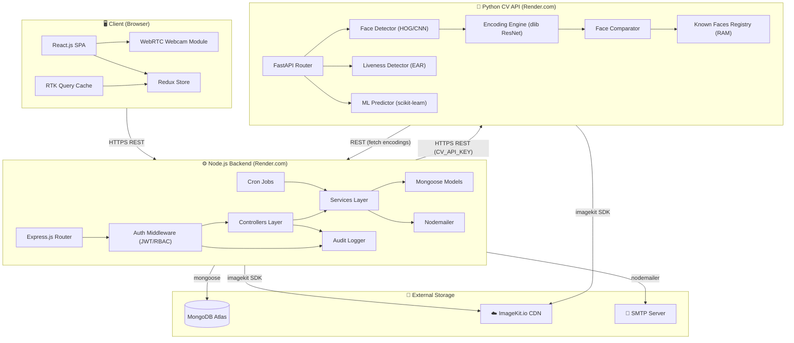
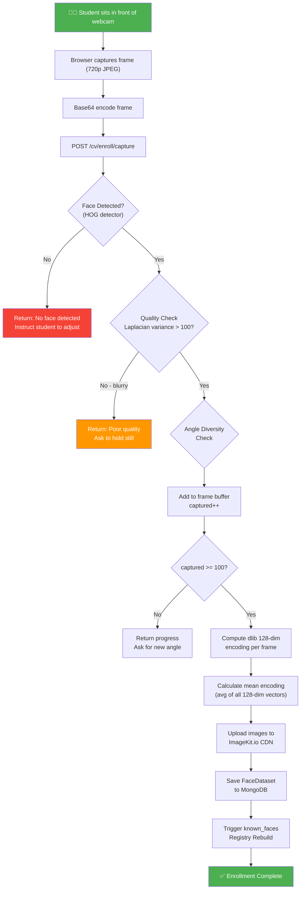
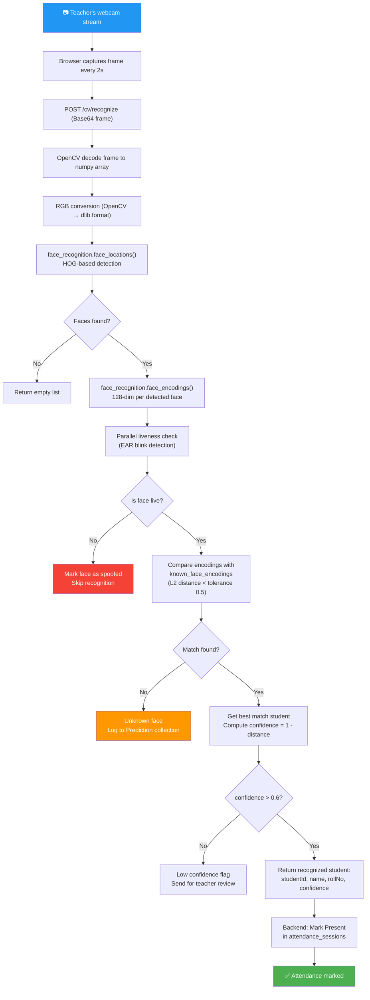
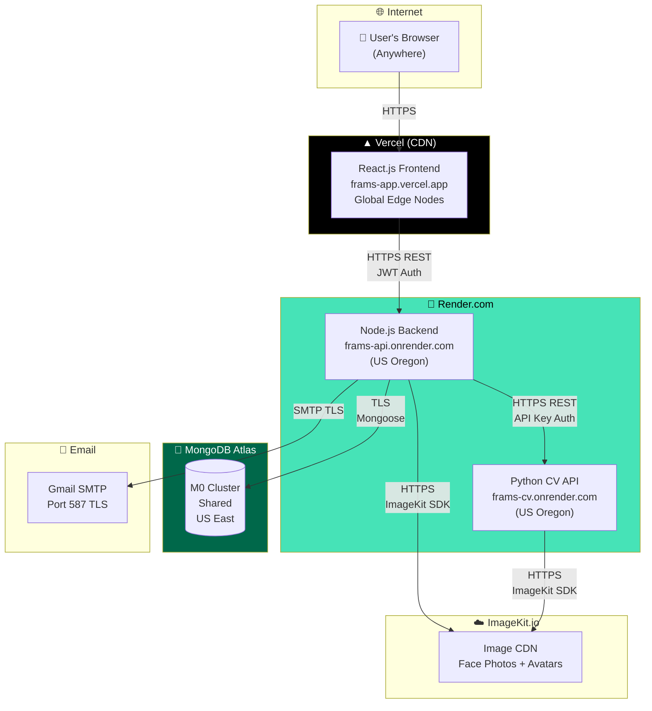
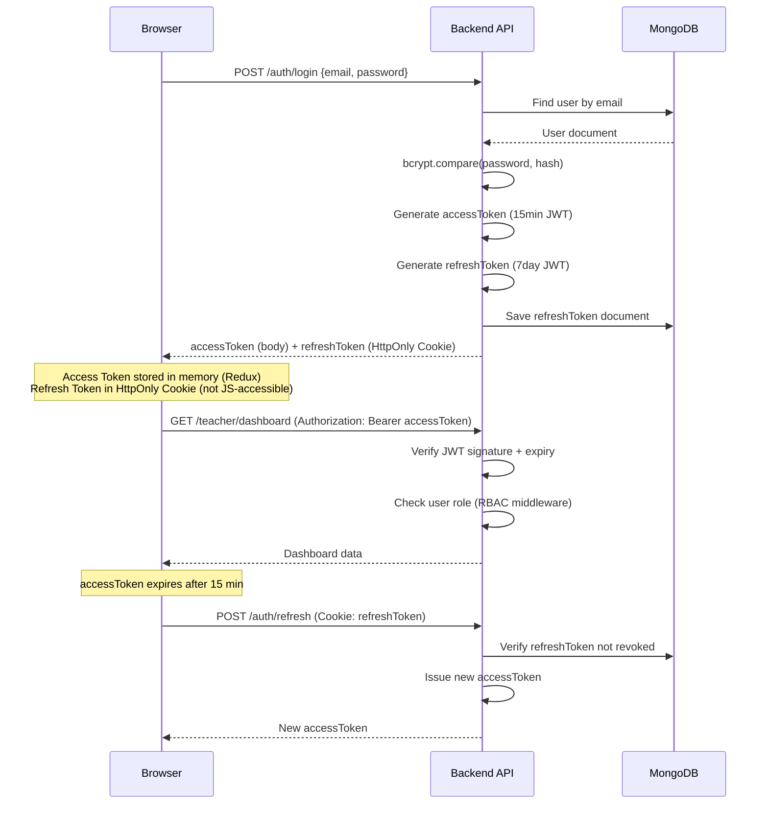

# System Architecture Document
## AI-Powered Face Recognition Attendance Management System (FRAMS)

---

## Table of Contents

1. [Architecture Overview](#1-architecture-overview)
2. [Three-Tier Architecture](#2-three-tier-architecture)
3. [Component Diagram](#3-component-diagram)
4. [Technology Stack](#4-technology-stack)
5. [Face Recognition Pipeline](#5-face-recognition-pipeline)
6. [ML Prediction Pipeline](#6-ml-prediction-pipeline)
7. [Data Flow Description](#7-data-flow-description)
8. [Deployment Architecture](#8-deployment-architecture)
9. [Security Architecture](#9-security-architecture)
10. [Technology Decisions and Justifications](#10-technology-decisions-and-justifications)

---

## 1. Architecture Overview

FRAMS follows a **microservice-inspired three-tier architecture** with three independently deployable services:

| Service | Technology | Role |
|---|---|---|
| **Frontend (Client)** | React.js 18 + Vite | Role-based SPA with webcam integration |
| **Backend API** | Node.js + Express.js | Business logic, auth, data access |
| **CV API** | Python + FastAPI | Face detection, recognition, ML predictions |

The services communicate over **HTTPS REST APIs**. The Backend acts as the orchestrator, calling the CV API when face operations are needed. The Frontend never directly calls the CV API.

```
                     ┌─────────────────────────────────────┐
                     │          INTERNET / BROWSER          │
                     └──────────────────┬──────────────────┘
                                        │ HTTPS
                            ┌───────────▼──────────┐
                            │   React.js Frontend   │
                            │  (Vercel CDN)         │
                            └───────────┬──────────┘
                                        │ HTTPS REST
                            ┌───────────▼──────────┐
                            │  Node.js Backend API  │
                            │  (Render.com)         │
                            └──────┬────────┬───────┘
                          HTTPS    │        │  HTTPS
                     ┌────────────▼─┐   ┌──▼──────────────┐
                     │  Python CV   │   │  MongoDB Atlas   │
                     │  FastAPI     │   │  (Database)      │
                     │  (Render.com)│   └─────────────────┘
                     └─────────────┘
                            │ HTTPS
                      ┌──────▼──────┐
                      │  ImageKit   │
                      │  CDN (Faces)│
                      └─────────────┘
```

---

## 2. Three-Tier Architecture

### Tier 1 – Presentation Layer (Frontend)

**Technology:** React.js 18 + Vite + Tailwind CSS

**Responsibilities:**
- Render role-based dashboards (Admin / Teacher / Student)
- Manage application state (Redux Toolkit + RTK Query)
- Handle webcam access via WebRTC / MediaDevices API for face recognition & dual-mode enrollment (`/student/face-profile`: 10 live photos or up to 10 multi-angle uploads)
- Handle optical camera QR code scanner via `html5-qrcode` (`/student/qr-scanner`)
- Capture device Geolocation (latitude, longitude) for location-restricted QR attendance check-in
- Capture and encode video frames as base64 JPEG
- Display real-time face recognition results
- Form validation (React Hook Form + Zod)

**Key Libraries:**

| Library | Version | Purpose |
|---|---|---|
| React | 18.2 | UI component framework |
| Redux Toolkit | 1.9 | Global state management |
| RTK Query | (RTK) | API caching and data fetching |
| React Router | 6.x | Client-side routing |
| html5-qrcode | 2.x | Optical QR camera scanner for student check-in |
| Tailwind CSS | 3.x | Utility-first styling |
| shadcn/ui | latest | Accessible UI components |
| Chart.js | 4.x | Attendance charts and graphs |
| React Hook Form | 7.x | Form state management |
| Zod | 3.x | Schema-based validation |
| Axios | 1.x | HTTP client with interceptors |
| date-fns | 3.x | Date manipulation |

---

### Tier 2 – Application Layer (Backend API)

**Technology:** Node.js 20 LTS + Express.js 4

**Responsibilities:**
- REST API endpoint implementation
- JWT authentication and authorization middleware
- Strict Teacher Access Control & Data Isolation (filtering `GET /subjects` and `GET /students` to teacher-assigned subjects and courses)
- Geolocation distance calculation (Haversine formula, default 50m radius) for QR attendance verification (`POST /api/v1/attendance/mark-qr`)
- Retrain AI Classifier trigger (`POST /api/v1/face/train` invoking Python FastAPI `POST /api/ml/train`)
- Business logic (session management, leave workflow, notification dispatch)
- Database operations via Mongoose ODM
- Inter-service communication to CV API
- File upload handling (ImageKit.io CDN integration)
- Email dispatch (Nodemailer)
- Rate limiting, CORS, helmet security headers
- Audit logging middleware
- Cron jobs (nightly attendance summaries, prediction refresh)

**Application Structure:**
```
backend/
├── config/           # DB, ImageKit, SMTP config
├── controllers/      # Route handlers (thin layer)
├── services/         # Business logic (thick layer)
├── models/           # Mongoose schemas
├── routes/           # Express routers by module
├── middleware/        # Auth, RBAC, rateLimiter, audit, errorHandler
├── utils/            # Email, helpers, validators
├── jobs/             # Cron job definitions
└── server.js         # Entry point
```

**Key Libraries:**

| Library | Version | Purpose |
|---|---|---|
| express | 4.18 | HTTP framework |
| mongoose | 7.x | MongoDB ODM |
| jsonwebtoken | 9.x | JWT generation and verification |
| bcryptjs | 2.x | Password hashing |
| express-rate-limit | 7.x | Rate limiting |
| helmet | 7.x | Security HTTP headers |
| cors | 2.x | Cross-origin request policy |
| multer | 1.x | File upload handling |
| imagekit | 1.x | Image CDN upload |
| nodemailer | 6.x | Email dispatch |
| node-cron | 3.x | Scheduled jobs |
| pdfkit | 0.x | PDF generation |
| exceljs | 4.x | Excel generation |
| express-validator | 7.x | Request validation |
| winston | 3.x | Structured logging |
| morgan | 1.x | HTTP request logging |

---

### Tier 3 – Data Layer

**Primary Database:** MongoDB Atlas (cloud, managed)

**Secondary Storage:** ImageKit.io CDN (face images, avatars, leave documents)

**In-Memory Cache (CV API):** Python dict `known_face_encodings` loaded at startup and rebuilt on enrollment

---

## 3. Component Diagram



---

## 4. Technology Stack

### Complete Stack Table

| Layer | Technology | Version | Justification |
|---|---|---|---|
| **Frontend Framework** | React.js | 18.2 | Industry standard, rich ecosystem, component reuse |
| **Build Tool** | Vite | 5.x | Faster HMR and build than CRA |
| **State Management** | Redux Toolkit | 1.9 | Predictable state, RTK Query for caching |
| **CSS Framework** | Tailwind CSS | 3.4 | Utility-first, highly customizable, no CSS files |
| **UI Components** | shadcn/ui | latest | Accessible, Radix-based, Tailwind compatible |
| **Charts** | Chart.js + react-chartjs-2 | 4.x | Free, flexible, good React integration |
| **Backend Runtime** | Node.js | 20 LTS | JavaScript full-stack, async I/O, npm ecosystem |
| **Backend Framework** | Express.js | 4.18 | Minimal, fast, most widely used Node framework |
| **Database** | MongoDB (Atlas) | 6.0 | Schema flexibility for complex nested attendance data |
| **ODM** | Mongoose | 7.x | Schema validation, middleware hooks, population |
| **Auth** | JWT (jsonwebtoken) | 9.x | Stateless, scalable, works across microservices |
| **Password Hash** | bcryptjs | 2.x | Industry standard, configurable cost factor |
| **CV Framework** | Python + FastAPI | 0.110 | Async, fast, auto-documentation, Pydantic validation |
| **Face Detection** | face_recognition (dlib) | 1.3 | High accuracy, easy API, proven in production |
| **Image Processing** | OpenCV | 4.9 | Industry standard for CV operations |
| **ML Framework** | scikit-learn | 1.4 | Easy-to-use, RandomForest for predictions |
| **Numerical** | NumPy | 1.26 | Required by face_recognition and scikit-learn |
| **Image CDN** | ImageKit.io | — | Free tier generous, transform API, auto-optimize |
| **Frontend Host** | Vercel | — | Free tier, global CDN, instant deployments |
| **Backend Host** | Render.com | — | Free tier supports Node.js, persistent disk |
| **CV API Host** | Render.com | — | Free tier supports Python, enough RAM for face encodings |
| **Email** | Nodemailer + Gmail SMTP | 6.x | Simple integration, free for academic use |
| **PDF** | pdfkit | 0.14 | Pure JavaScript, no external dependencies |
| **Excel** | exceljs | 4.4 | Feature-rich Excel generation |

---

## 5. Face Recognition Pipeline

### 5.1 Enrollment Pipeline



### 5.2 Recognition Pipeline



### 5.3 Liveness Detection Detail

The Eye Aspect Ratio (EAR) method detects eye blinks to confirm a live person:

```python
# EAR Formula
EAR = (||p2-p6|| + ||p3-p5||) / (2 * ||p1-p4||)

# Where p1-p6 are the 6 facial landmark coordinates around each eye

# Thresholds
EAR_THRESHOLD = 0.25  # Below this = eye closed
CONSEC_FRAMES = 3     # Frames eye must be closed = 1 blink
MIN_BLINKS = 1        # Minimum blinks required for liveness
```

Additional liveness signals:
- **Head pose estimation** using solvePnP (3D facial landmarks)
- **Micro-expression detection** (subtle facial movements across frames)
- **Texture analysis** (photo vs. real skin texture)

---

## 6. ML Prediction Pipeline


### Feature Set

| Feature | Description | Type |
|---|---|---|
| `current_attendance_pct` | Current attendance percentage | Float (0–100) |
| `weekly_absence_rate` | Avg absences per week | Float (0–1) |
| `longest_absence_streak` | Consecutive absent days | Integer |
| `leaves_taken` | Approved leave days this semester | Integer |
| `monday_absence_rate` | % absent on Mondays (common proxy pattern) | Float |
| `remaining_lectures` | Estimated remaining lectures in semester | Integer |
| `semester_week` | Current week of semester (1–20) | Integer |
| `low_attendance_weeks` | Weeks where weekly % < 75 | Integer |

### Target Labels

| Label | Condition |
|---|---|
| `low` | Model predicts end-of-semester attendance ≥ 80% |
| `medium` | Predicted attendance 75–79% |
| `high` | Predicted attendance < 75% |

---

## 7. Data Flow Description

### 7.1 Attendance Marking Flow

```
Teacher → [Browser] → POST /attendance/sessions (Backend)
                            ↓
                    Create session doc in MongoDB
                            ↓
Teacher → [Browser] → Webcam capture
                            ↓
                    Base64 frame → POST /cv/recognize (Backend)
                            ↓
                    Backend → POST (CV API) /recognize
                            ↓
                    CV API: detect → encode → compare → liveness
                            ↓
                    CV API → Backend: { recognizedStudents }
                            ↓
                    Backend → MongoDB: mark Present for each
                            ↓
                    Backend → Browser: { marked, list }
                            ↓
                    Teacher → PATCH /sessions/:id/close
                            ↓
                    Backend: auto-mark remaining as Absent
                            ↓
                    Backend: calculate attendance %
                            ↓
                    Backend: if % < 75 → create Notification
                            ↓
                    Student's dashboard updated next load
```

### 7.2 Leave Request Flow

```
Student → POST /leaves (with dates, reason, document)
                ↓
        Backend: validate → create LeaveRequest (pending)
                ↓
        Backend: notify assigned teachers
                ↓
Teacher → PATCH /leaves/:id/approve (or reject)
                ↓
        Backend: update LeaveRequest status
                ↓
        If approved:
        Backend: update Attendance records for leave period → "Leave" status
                ↓
        Backend: notify student
                ↓
        Student dashboard: leave status updated
```

---

## 8. Deployment Architecture



### Environment Separation

| Environment | Frontend | Backend | Database | Notes |
|---|---|---|---|---|
| **Development** | http://localhost:5173 | http://localhost:5000 | Local MongoDB or Atlas | `.env.local` files |
| **Staging** | Vercel preview URL | Render preview URL | Atlas test cluster | Auto-deployed from `develop` branch |
| **Production** | https://frams-app.vercel.app | https://frams-api.onrender.com | Atlas M0 cluster | Deployed from `main` branch |

---

## 9. Security Architecture

### Authentication Flow



### RBAC Middleware

```javascript
// Roles hierarchy
const ROLES = {
  admin: ['admin'],
  teacher: ['admin', 'teacher'],
  student: ['admin', 'teacher', 'student'],
  any: ['admin', 'teacher', 'student']
};

// Middleware usage
router.get('/admin/users', auth, requireRole('admin'), getUsersList);
router.post('/attendance/sessions', auth, requireRole('teacher'), createSession);
router.get('/student/dashboard', auth, requireRole('student'), getStudentDashboard);
```

---

## 10. Technology Decisions and Justifications

### Why MongoDB over SQL?

| Consideration | MongoDB | PostgreSQL |
|---|---|---|
| Schema flexibility | ✅ Easy to add fields (e.g., editHistory array) | Requires migrations |
| Attendance queries | ✅ Aggregation pipeline very powerful | ✅ SQL also powerful |
| Horizontal scaling | ✅ Built-in sharding | Requires partitioning |
| Face encoding storage | ✅ Can store arrays natively | Would need JSONB or table |
| Academic use (free tier) | ✅ Atlas M0 free tier | Requires paid hosting |
| **Verdict** | **✅ Better for this project** | — |

### Why Python/FastAPI for CV API?

- **face_recognition** library is Python-only (dlib binding)
- Python has the richest CV/ML ecosystem (OpenCV, NumPy, scikit-learn, PyTorch)
- FastAPI provides automatic OpenAPI documentation and Pydantic validation
- Async support handles multiple concurrent recognition requests
- No equivalent Node.js library for CPU-based face recognition

### Why React.js + Redux Toolkit?

- Rich component ecosystem (shadcn/ui, Chart.js)
- WebRTC webcam access is well-documented in React
- RTK Query reduces API boilerplate significantly
- Excellent DevTools for debugging state and API calls
- Strong community support for interview/production scenarios

### Why JWT over Session?

- **Stateless**: No session store required → horizontal scaling without sticky sessions
- **Interoperability**: Same token works for Backend and CV API (with shared secret or different secrets)
- **Security**: Short expiry access token + HTTP-only refresh token pattern mitigates most token theft risks
- **Performance**: No DB lookup per request for token validation (only JWT verification)

### Why Render.com over AWS/GCP?

- **Free tier**: Sufficient for academic demonstration
- **Simplicity**: Git-push deployment, auto-TLS certificates
- **Python support**: Can deploy FastAPI with custom build commands for dlib
- **Persistent disk**: Available for storing trained ML model artifacts
- Trade-off: Cold starts on free tier (30s); acceptable for academic demo

### Face Recognition Tolerance

The `tolerance` parameter in face_recognition (default: 0.6) controls strictness:
- `0.4–0.5`: Very strict – fewer false positives, more false negatives (some students not recognized)
- `0.5` (configured): Balanced for classroom use with good lighting
- `0.6`: More lenient – higher false positive risk

The system uses **0.5** with a confidence threshold of **0.6** for the final match decision.

---

*End of System Architecture Document*
*FRAMS Project | B.Tech CS Final Year | Version 1.0 | July 2026*
