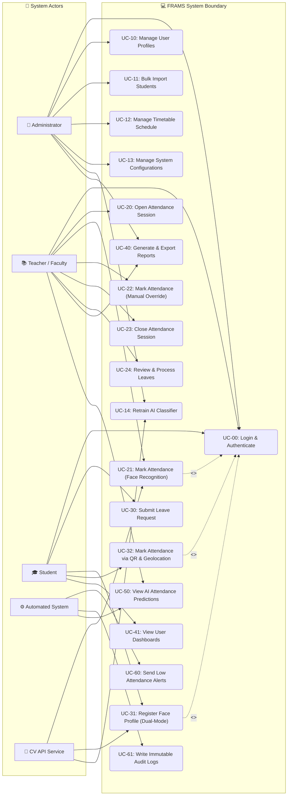

# Use Case Diagram & Specifications
## AI-Powered Face Recognition Attendance Management System (FRAMS)

This document presents the system's functional requirements from the perspective of its users (actors). It contains a Mermaid diagram mapping the actors to their respective use cases, brief descriptions of all system use cases, and detailed specifications for 5 primary use cases.

---

## 1. Use Case Diagram (Mermaid)

The diagram below shows the system boundary, the actors, and their interactions with the system's core capabilities.

---

## 2. Brief Descriptions of All Use Cases

*   **UC-00: Login & Authenticate**: Provides role-based access using emails and password hashes. Handles JWT cookie issuance and session resets.
*   **UC-10: Manage User Profiles**: Admin handles CRUD configurations for departments, student rosters, and teacher assignments.
*   **UC-11: Bulk Import Students**: Parses academic CSV logs to batch-generate hundreds of student profiles.
*   **UC-12: Manage Timetable Schedule**: Maps teachers, courses, sections, and subjects to physical classrooms while checking for double-bookings.
*   **UC-13: Manage System Configurations**: Sets system variables, such as the 75% attendance threshold and face match tolerances.
*   **UC-20: Open Attendance Session**: Starts a lecture session, confirming that there are no active duplicates.
*   **UC-21: Mark Attendance (Face Recognition)**: Processes frame sequences, evaluates facial parameters against stored templates, and marks matching records.
*   **UC-22: Mark Attendance (Manual Override)**: Allows teachers to manually adjust a student's status when face detection is not possible.
*   **UC-23: Close Attendance Session**: Ends the active session, marks missing students as absent, and updates percentage trends.
*   **UC-24: Review & Process Leaves**: Teachers approve or reject leave requests, which automatically updates attendance records.
*   **UC-30: Submit Leave Request**: Students upload reasons and optional attachments for medical or academic leaves.
*   **UC-31: Register Face Dataset**: Prompts the student to look at the webcam from multiple angles to compile 100 facial vector templates.
*   **UC-40: Generate & Export Reports**: Compiles summaries for subjects, classes, or students, and exports them to PDF or Excel formats.
*   **UC-41: View User Dashboards**: Provides customized widgets and attendance charts for students and teachers.
*   **UC-50: View AI Attendance Predictions**: Predicts end-of-semester attendance percentages using a Random Forest model.
*   **UC-60: Send Low Attendance Alerts**: Sends warnings to students whose attendance falls below the configured threshold.
*   **UC-61: Write Immutable Audit Logs**: Records all critical administrative actions in a read-only database log.

---

## 3. Detailed Use Case Specifications

The tables below provide the detailed flow, preconditions, postconditions, and error handling for the 5 key system use cases.

### UC-01: Mark Attendance via Face Recognition

| Field | Details |
|---|---|
| **Use Case Name** | Mark Attendance via Face Recognition |
| **Actors** | Teacher (Primary), CV API Service (Supporting), System (Supporting) |
| **Description** | Automates class attendance by recognizing student faces via a live webcam stream and updating attendance records. |
| **Preconditions** | 1. Teacher is authenticated and has an active dashboard session. 2. The subject, section, and classroom are scheduled for the current period. 3. Registered face templates exist for the students in the class. 4. The CV API Service is active and reachable. |
| **Postconditions** | 1. Recognized students are marked `Present` in the session. 2. An `AttendanceSession` record is saved, showing total stats. 3. Attendance records are updated, and notifications are sent to students marked absent. |
| **Main Flow** | 1. Teacher clicks **Start Session** on the dashboard, selecting the subject and section. 2. The System validates the class timetable and opens a new session. 3. The System starts the webcam feed and displays the session dashboard. 4. The webcam captures frames and sends them to the CV API for analysis. 5. The CV API matches detected faces against stored student templates. 6. The CV API runs liveness checks (eye blinks and head movements) to prevent spoofing. 7. The CV API returns recognized Student IDs with confidence scores. 8. The System marks recognized students as `Present` and updates the dashboard in real time. 9. The Teacher clicks **Close Session** to end the process. 10. The System marks all remaining students as `Absent` and updates their attendance percentages. |
| **Alternative Flows** | *   **A1 (Face Not Recognized):** If a student is not recognized, they can be marked present using the manual override panel (UC-22). *   **A2 (Liveness Check Failed):** If the CV API flags a face as a spoof (e.g. photo on phone), it is rejected, and a warning is logged in the prediction history. |
| **Exception Flows** | *   **E1 (CV API Offline):** The System displays a warning banner ("CV Service Offline") and prompts the teacher to mark attendance manually. |

---

### UC-02: Enroll Student Face Dataset

| Field | Details |
|---|---|
| **Use Case Name** | Register Face Dataset |
| **Actors** | Student (Primary), Administrator (Supporting), CV API Service (Supporting) |
| **Description** | Captures 100 face images of a student from multiple angles, calculates their 128-dimensional encodings, and stores them in the database. |
| **Preconditions** | 1. Student profile exists in the database. 2. The user has access to a working webcam (HD 720p minimum). 3. Student does not have verified face data already registered. |
| **Postconditions** | 1. 100 face images are uploaded to the ImageKit.io CDN. 2. Stored encodings are updated, and the student's `faceEnrolled` status is set to `true`. 3. The known faces memory cache is rebuilt. |
| **Main Flow** | 1. Operator opens the Student Profile and clicks **Enroll Face Data**. 2. The System requests webcam permissions and initializes the registration wizard. 3. The System displays a circular overlay on the screen to guide the user's face alignment. 4. The webcam sends video frames to the CV API for real-time validation. 5. The CV API checks image quality (blur score, lighting, face size). 6. If the frame is valid, the CV API saves it and increments the progress bar. 7. The wizard guides the user to look in different directions (left, right, up, down, center). 8. Once 100 valid frames are captured, the CV API computes the mean face encoding. 9. The System uploads the images to ImageKit.io and saves the metadata and encodings to the database. 10. The System sets the student's `faceEnrolled` flag to `true` and rebuilds the known faces cache. |
| **Alternative Flows** | *   **A1 (Re-enrollment):** If the student's appearance changes significantly, the Admin can clear the existing dataset, which triggers a cache rebuild and allows a new enrollment. |
| **Exception Flows** | *   **E1 (Blurry / Poor Lighting):** If the frames fail quality checks, the System pauses capture, displays a warning ("Please stand in a well-lit area"), and resumes when conditions improve. |

---

### UC-03: Submit and Process Leave Request

| Field | Details |
|---|---|
| **Use Case Name** | Submit and Process Leave Request |
| **Actors** | Student (Primary), Teacher (Secondary), System (Supporting) |
| **Description** | Allows students to submit leave applications, which teachers can review. Approved leaves automatically update the student's attendance records. |
| **Preconditions** | 1. Student has an active account and is currently enrolled. 2. The leave dates do not conflict with existing leave periods. |
| **Postconditions** | 1. A `LeaveRequest` record is saved in the database. 2. If approved, affected attendance records are updated from `Absent` to `Leave`. |
| **Main Flow** | 1. Student clicks **Apply for Leave** on their dashboard. 2. Student enters the date range, selects the leave type, enters a reason, and uploads supporting documents (e.g. medical certificate). 3. The System validates the inputs and saves the request as `pending`. 4. The System sends a notification to the teachers assigned to the student's subjects. 5. Teacher logs in, views the pending requests, and reviews the reasons and documents. 6. Teacher clicks **Approve** or **Reject** (rejections require a comment). 7. The System updates the request status and notifies the student. 8. If approved, the System updates any `Absent` records within the leave range to `Leave` status. |
| **Alternative Flows** | *   **A1 (Student Cancels Request):** If the request is still pending, the Student can cancel it from their dashboard, which deletes the record. |
| **Exception Flows** | *   **E1 (Invalid Dates):** If the student selects dates in the future beyond the semester limit, the system rejects the submission with a validation error. |

---

### UC-04: Generate and Export Attendance Report

| Field | Details |
|---|---|
| **Use Case Name** | Generate and Export Reports |
| **Actors** | Teacher (Primary), Administrator (Primary), System (Supporting) |
| **Description** | Generates detailed attendance summaries for subjects, classes, or students, and exports them to PDF or Excel formats. |
| **Preconditions** | 1. Active attendance records exist in the database for the selected criteria and date range. |
| **Postconditions** | 1. A report file (PDF or Excel) is generated and downloaded to the user's local storage. |
| **Main Flow** | 1. User navigates to the **Reports** section on the dashboard. 2. User selects the report type (e.g., *Class Report* or *Student Summary*). 3. User applies filters: Subject, Section, Semester, and Date Range. 4. The System queries the database and generates a preview of the report on the screen. 5. User selects the export format (PDF or Excel). 6. The System processes the data using the document generation library (pdfkit or exceljs). 7. The System streams the generated file to the user's browser for download. |
| **Alternative Flows** | *   **A1 (Schedule Emailed Report):** Admins can schedule monthly report generation, which are automatically emailed to department heads. |
| **Exception Flows** | *   **E1 (No Data Found):** If the query returns no records, the system displays a message ("No records found for the selected filters") and disables the export options. |

---

### UC-05: View AI Attendance Shortage Prediction

| Field | Details |
|---|---|
| **Use Case Name** | View AI Attendance Shortage Prediction |
| **Actors** | Teacher (Primary), Administrator (Primary), System (Supporting) |
| **Description** | Predicts which students are likely to fall below the 75% attendance requirement by the end of the semester, allowing early intervention. |
| **Preconditions** | 1. The prediction model is trained and active on the CV/ML API service. 2. At least 4 weeks of attendance data is available for the current semester. |
| **Postconditions** | 1. Prediction results are displayed on the dashboard, grouped by risk level (High, Medium, Low). |
| **Main Flow** | 1. Teacher clicks **AI Predictions** on their dashboard. 2. The System queries the ML API for the latest prediction results. 3. The ML API retrieves student feature data (current attendance, absence trends, leave history). 4. The ML API runs predictions using the RandomForest model. 5. The ML API returns the predicted end-of-semester attendance percentages and risk categories. 6. The System displays the results in a color-coded table (Red for High Risk, Orange for Medium Risk, Green for Low Risk). 7. The Teacher can select high-risk students and send them automated warning notifications. |
| **Alternative Flows** | *   **A1 (Model Retraining):** Admin can manually trigger retraining of the prediction model from the configurations panel to improve prediction accuracy. |
| **Exception Flows** | *   **E1 (Insufficient Data):** If the semester has just started, the system displays a message ("Predictions will be available after 4 weeks of classes") and hides the stats table. |

---

*End of Use Case Diagram & Specifications Document*
*FRAMS Project | B.Tech CS Final Year | Version 1.0 | July 2026*
