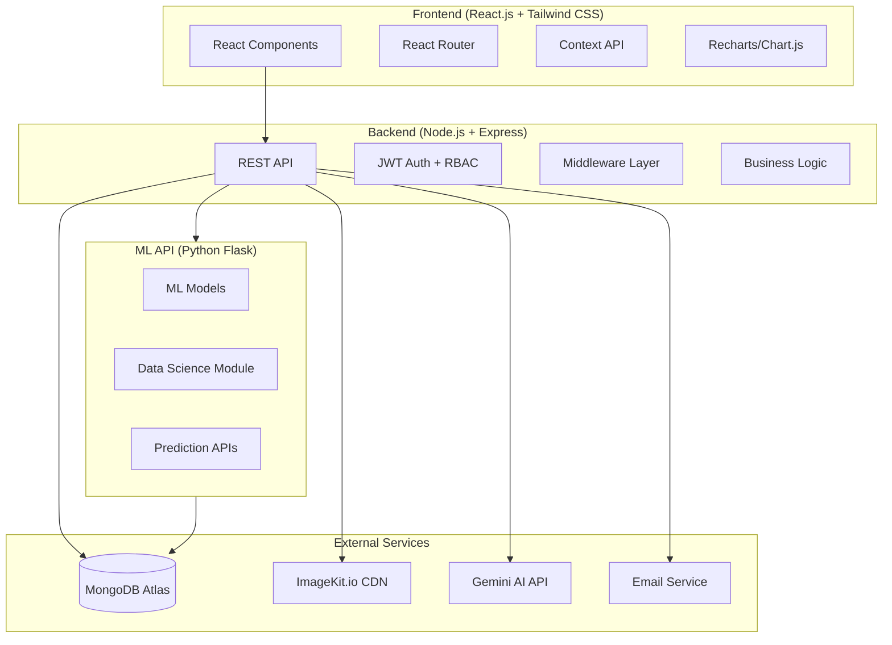

# AI-Powered Attendance Management System (AMS) - Implementation Plan

## Project Overview

A production-ready web application for managing attendance in educational institutions, integrating Data Science, Machine Learning, Analytics, and AI features. The system supports three user roles (Admin, Teacher, Student) with role-based dashboards and permissions.

## System Architecture



## Folder Structure

```
d:\AMS\
├── client/                          # React Frontend
│   ├── public/
│   ├── src/
│   │   ├── assets/                  # Static assets
│   │   ├── components/              # Reusable components
│   │   │   ├── common/              # Buttons, Inputs, Modals, etc.
│   │   │   ├── charts/              # Chart components
│   │   │   ├── attendance/          # Attendance-related components
│   │   │   ├── dashboard/           # Dashboard widgets
│   │   │   └── layout/             # Layout components
│   │   ├── contexts/                # React Context providers
│   │   ├── hooks/                   # Custom hooks
│   │   ├── layouts/                 # Page layouts
│   │   ├── pages/                   # Page components
│   │   │   ├── admin/
│   │   │   ├── teacher/
│   │   │   ├── student/
│   │   │   └── auth/
│   │   ├── services/                # API service functions
│   │   ├── utils/                   # Utility functions
│   │   ├── App.jsx
│   │   ├── main.jsx
│   │   └── index.css
│   ├── package.json
│   ├── tailwind.config.js
│   └── vite.config.js
│
├── server/                          # Node.js Backend
│   ├── config/                      # Configuration files
│   ├── controllers/                 # Route controllers
│   ├── middleware/                   # Custom middleware
│   ├── models/                      # Mongoose schemas
│   ├── routes/                      # API routes
│   ├── services/                    # Business logic services
│   ├── utils/                       # Utility functions
│   ├── validators/                  # Input validation schemas
│   ├── seeds/                       # Database seed data
│   ├── server.js                    # Entry point
│   └── package.json
│
├── ml-api/                          # Python ML/DS API
│   ├── models/                      # Saved ML models (.joblib)
│   ├── data/                        # Sample/training data
│   ├── notebooks/                   # Jupyter notebooks for analysis
│   ├── services/                    # ML service modules
│   ├── routes/                      # Flask API routes
│   ├── utils/                       # Python utilities
│   ├── app.py                       # Flask entry point
│   └── requirements.txt
│
├── docs/                            # Documentation
│   ├── diagrams/                    # UML, ER, DFD diagrams
│   ├── api/                         # API documentation
│   ├── srs/                         # SRS document
│   └── guides/                      # User guides
│
└── README.md
```

## Database Schema Design

### Users Collection
```javascript
{
  _id: ObjectId,
  email: String (unique, indexed),
  password: String (bcrypt hashed),
  role: String (enum: 'admin', 'teacher', 'student'),
  firstName: String,
  lastName: String,
  phone: String,
  avatar: String (ImageKit URL),
  isEmailVerified: Boolean,
  emailVerificationToken: String,
  passwordResetToken: String,
  passwordResetExpires: Date,
  refreshToken: String,
  isActive: Boolean,
  lastLogin: Date,
  createdAt: Date,
  updatedAt: Date
}
```

### Departments Collection
```javascript
{
  _id: ObjectId,
  name: String (unique),
  code: String (unique),
  description: String,
  head: ObjectId (ref: Users),
  isActive: Boolean,
  createdAt: Date,
  updatedAt: Date
}
```

### Courses Collection
```javascript
{
  _id: ObjectId,
  name: String,
  code: String (unique),
  department: ObjectId (ref: Departments),
  duration: Number (semesters),
  description: String,
  isActive: Boolean,
  createdAt: Date,
  updatedAt: Date
}
```

### Subjects Collection
```javascript
{
  _id: ObjectId,
  name: String,
  code: String (unique),
  course: ObjectId (ref: Courses),
  department: ObjectId (ref: Departments),
  semester: Number,
  credits: Number,
  teacher: ObjectId (ref: Users),
  type: String (enum: 'theory', 'practical', 'elective'),
  isActive: Boolean,
  createdAt: Date,
  updatedAt: Date
}
```

### Students Collection
```javascript
{
  _id: ObjectId,
  user: ObjectId (ref: Users),
  rollNumber: String (unique),
  enrollmentNumber: String (unique),
  department: ObjectId (ref: Departments),
  course: ObjectId (ref: Courses),
  semester: Number,
  section: String,
  batch: String (e.g., '2022-2026'),
  guardianName: String,
  guardianPhone: String,
  address: String,
  dateOfBirth: Date,
  gender: String,
  admissionDate: Date,
  isActive: Boolean,
  createdAt: Date,
  updatedAt: Date
}
```

### Teachers Collection
```javascript
{
  _id: ObjectId,
  user: ObjectId (ref: Users),
  employeeId: String (unique),
  department: ObjectId (ref: Departments),
  designation: String,
  qualification: String,
  specialization: String,
  joiningDate: Date,
  subjects: [ObjectId] (ref: Subjects),
  isActive: Boolean,
  createdAt: Date,
  updatedAt: Date
}
```

### Attendance Collection
```javascript
{
  _id: ObjectId,
  student: ObjectId (ref: Students),
  subject: ObjectId (ref: Subjects),
  teacher: ObjectId (ref: Users),
  date: Date (indexed),
  status: String (enum: 'present', 'absent', 'late', 'excused'),
  markedAt: Date,
  method: String (enum: 'manual', 'qr', 'geolocation'),
  location: { lat: Number, lng: Number },
  qrSessionId: String,
  remarks: String,
  isLateEntry: Boolean,
  lateMinutes: Number,
  period: Number,
  semester: Number,
  academicYear: String,
  createdAt: Date,
  updatedAt: Date
}
// Compound index: { student, subject, date, period } (unique - duplicate prevention)
```

### Timetable Collection
```javascript
{
  _id: ObjectId,
  course: ObjectId (ref: Courses),
  department: ObjectId (ref: Departments),
  semester: Number,
  section: String,
  day: String (enum weekdays),
  slots: [{
    period: Number,
    startTime: String,
    endTime: String,
    subject: ObjectId (ref: Subjects),
    teacher: ObjectId (ref: Users),
    room: String
  }],
  effectiveFrom: Date,
  effectiveTo: Date,
  isActive: Boolean,
  createdAt: Date,
  updatedAt: Date
}
```

### Notifications Collection
```javascript
{
  _id: ObjectId,
  sender: ObjectId (ref: Users),
  recipients: [ObjectId] (ref: Users),
  title: String,
  message: String,
  type: String (enum: 'attendance', 'leave', 'alert', 'general'),
  priority: String (enum: 'low', 'medium', 'high'),
  isRead: Map (userId -> Boolean),
  createdAt: Date,
  updatedAt: Date
}
```

### LeaveRequests Collection
```javascript
{
  _id: ObjectId,
  student: ObjectId (ref: Students),
  subject: ObjectId (ref: Subjects),
  startDate: Date,
  endDate: Date,
  reason: String,
  type: String (enum: 'medical', 'personal', 'family', 'other'),
  attachments: [String],
  status: String (enum: 'pending', 'approved', 'rejected'),
  reviewedBy: ObjectId (ref: Users),
  reviewedAt: Date,
  reviewRemarks: String,
  createdAt: Date,
  updatedAt: Date
}
```

### Reports Collection
```javascript
{
  _id: ObjectId,
  generatedBy: ObjectId (ref: Users),
  type: String (enum: 'daily', 'weekly', 'monthly', 'semester', 'custom'),
  scope: String (enum: 'student', 'subject', 'department', 'course'),
  filters: Object,
  data: Object,
  fileUrl: String,
  format: String (enum: 'pdf', 'csv', 'xlsx'),
  createdAt: Date,
  updatedAt: Date
}
```

### Predictions Collection
```javascript
{
  _id: ObjectId,
  student: ObjectId (ref: Students),
  type: String (enum: 'attendance', 'risk', 'performance'),
  prediction: Object,
  confidence: Number,
  model: String,
  features: Object,
  generatedAt: Date,
  validUntil: Date,
  createdAt: Date,
  updatedAt: Date
}
```

### AuditLogs Collection
```javascript
{
  _id: ObjectId,
  user: ObjectId (ref: Users),
  action: String,
  resource: String,
  resourceId: ObjectId,
  details: Object,
  ipAddress: String,
  userAgent: String,
  createdAt: Date
}
```

## API Design

### Authentication APIs
| Method | Endpoint | Description |
|--------|----------|-------------|
| POST | /api/auth/register | Register new user |
| POST | /api/auth/login | Login |
| POST | /api/auth/logout | Logout |
| POST | /api/auth/refresh-token | Refresh JWT |
| GET | /api/auth/verify-email/:token | Verify email |
| POST | /api/auth/forgot-password | Send reset link |
| POST | /api/auth/reset-password/:token | Reset password |
| GET | /api/auth/me | Get current user |

### Admin APIs
| Method | Endpoint | Description |
|--------|----------|-------------|
| GET/POST | /api/admin/departments | List/Create departments |
| GET/PUT/DELETE | /api/admin/departments/:id | CRUD department |
| GET/POST | /api/admin/courses | List/Create courses |
| GET/PUT/DELETE | /api/admin/courses/:id | CRUD course |
| GET/POST | /api/admin/subjects | List/Create subjects |
| GET/PUT/DELETE | /api/admin/subjects/:id | CRUD subject |
| GET/POST | /api/admin/students | List/Create students |
| GET/PUT/DELETE | /api/admin/students/:id | CRUD student |
| GET/POST | /api/admin/teachers | List/Create teachers |
| GET/PUT/DELETE | /api/admin/teachers/:id | CRUD teacher |
| POST | /api/admin/assign-subject | Assign subject to teacher |
| GET | /api/admin/analytics | Get admin analytics |
| GET | /api/admin/users | Manage all users |
| GET | /api/admin/audit-logs | View audit logs |

### Attendance APIs
| Method | Endpoint | Description |
|--------|----------|-------------|
| POST | /api/attendance/mark | Mark attendance (manual) |
| POST | /api/attendance/bulk | Bulk mark attendance |
| POST | /api/attendance/qr/generate | Generate QR session |
| POST | /api/attendance/qr/scan | Scan QR attendance |
| POST | /api/attendance/verify-location | Verify geolocation |
| GET | /api/attendance/history | Get attendance history |
| GET | /api/attendance/student/:id | Get student attendance |
| GET | /api/attendance/subject/:id | Subject attendance |
| GET | /api/attendance/daily | Daily attendance report |
| GET | /api/attendance/monthly | Monthly report |
| POST | /api/attendance/correction | Request correction |
| GET | /api/attendance/percentage/:studentId | Attendance % |

### Analytics APIs
| Method | Endpoint | Description |
|--------|----------|-------------|
| GET | /api/analytics/overview | Dashboard overview |
| GET | /api/analytics/department/:id | Dept analysis |
| GET | /api/analytics/subject/:id | Subject analysis |
| GET | /api/analytics/trends | Trend analysis |
| GET | /api/analytics/heatmap | Attendance heatmap |
| GET | /api/analytics/rankings | Student rankings |
| GET | /api/analytics/teacher-stats | Teacher statistics |

### Reports APIs
| Method | Endpoint | Description |
|--------|----------|-------------|
| POST | /api/reports/generate | Generate report |
| GET | /api/reports/download/:id | Download report |
| GET | /api/reports | List reports |

### ML/Prediction APIs
| Method | Endpoint | Description |
|--------|----------|-------------|
| POST | /api/ml/predict/attendance | Predict attendance |
| POST | /api/ml/predict/risk | Risk detection |
| POST | /api/ml/predict/performance | Performance prediction |
| GET | /api/ml/clustering | Attendance patterns |
| POST | /api/ml/leave-recommendation | Leave recommendation |
| GET | /api/ml/model-metrics | Model evaluation |

### AI Assistant APIs
| Method | Endpoint | Description |
|--------|----------|-------------|
| POST | /api/ai/chat | AI chat query |
| POST | /api/ai/report | AI-generated report |
| POST | /api/ai/summary | Generate summary |

### Notification APIs
| Method | Endpoint | Description |
|--------|----------|-------------|
| GET | /api/notifications | Get notifications |
| POST | /api/notifications | Send notification |
| PUT | /api/notifications/:id/read | Mark as read |

### Leave Request APIs
| Method | Endpoint | Description |
|--------|----------|-------------|
| POST | /api/leaves | Submit leave request |
| GET | /api/leaves | List leave requests |
| PUT | /api/leaves/:id | Update leave status |

### Timetable APIs
| Method | Endpoint | Description |
|--------|----------|-------------|
| GET/POST | /api/timetable | List/Create timetable |
| GET/PUT/DELETE | /api/timetable/:id | CRUD timetable |

## Phased Development Plan

### Phase 1: Project Setup & Authentication (Foundation)
1. Initialize monorepo structure
2. Setup Vite + React + Tailwind (client)
3. Setup Express + MongoDB (server)
4. Setup Flask (ml-api)
5. Implement User model and auth routes
6. JWT + refresh token flow
7. Email verification & password reset
8. Role-based middleware
9. Security middleware (helmet, rate-limit, cors, xss)

### Phase 2: Core Backend - Models & CRUD APIs
1. All Mongoose models with validation
2. Department CRUD
3. Course CRUD
4. Subject CRUD
5. Student CRUD
6. Teacher CRUD
7. Timetable CRUD
8. Input validation (express-validator/Joi)
9. Error handling middleware
10. Pagination, sorting, filtering utilities

### Phase 3: Attendance Module
1. Manual attendance marking
2. Bulk attendance
3. QR code generation & scanning
4. Geolocation verification
5. Late entry detection
6. Duplicate prevention (compound index)
7. Attendance correction requests
8. Real-time attendance tracking
9. Attendance history & reports

### Phase 4: Frontend - Auth & Layout
1. Design system setup (Tailwind config, theme)
2. Auth pages (Login, Register, Forgot Password, Reset, Verify Email)
3. Layout components (Sidebar, Navbar, Footer)
4. Protected routes with role-based guards
5. Context providers (Auth, Theme, Notification)
6. Common components (Button, Input, Modal, Table, etc.)
7. Dark mode toggle
8. Responsive design

### Phase 5: Frontend - Admin Dashboard & Management
1. Admin dashboard with stats widgets
2. Department management pages
3. Course management pages
4. Subject management pages
5. Student management (CRUD, import, search)
6. Teacher management (CRUD, assign subjects)
7. User management
8. Timetable management

### Phase 6: Frontend - Teacher & Student Dashboards
1. Teacher dashboard
2. Attendance marking interface (manual + QR)
3. Attendance history views
4. Student dashboard
5. Attendance calendar view
6. Subject-wise attendance breakdown
7. Notification center
8. Leave request system

### Phase 7: Analytics & Reporting
1. Backend analytics aggregation pipelines
2. Admin analytics dashboard (all charts)
3. Department, subject, trend analysis charts
4. Heatmaps, rankings, teacher stats
5. Report generation (PDF, CSV, Excel)
6. Export functionality
7. Attendance calendar with color coding

### Phase 8: Data Science Module (Python)
1. Data extraction from MongoDB
2. Missing value analysis
3. Attendance distribution analysis
4. Correlation analysis
5. Trend analysis & feature engineering
6. Statistical summaries
7. Visual report generation (Matplotlib)

### Phase 9: Machine Learning Module
1. Data preprocessing pipeline
2. Attendance prediction model (Logistic Regression, RF, XGBoost)
3. Risk detection model
4. Attendance percentage prediction (Linear Regression)
5. Performance prediction model
6. Leave recommendation system
7. Attendance pattern clustering (KMeans)
8. Model evaluation (Accuracy, Precision, Recall, F1, ROC-AUC)
9. Model serialization (Joblib)
10. Flask prediction API endpoints

### Phase 10: AI Integration
1. Gemini API integration
2. Natural language query processing
3. AI-powered attendance insights
4. Automated PDF report generation
5. AI chat assistant interface

### Phase 11: Additional Features
1. Email notifications (Nodemailer)
2. Audit logs & activity timeline
3. Search, filter, pagination across all views
4. QR attendance flow (complete)
5. Responsive polish for mobile/tablet

### Phase 12: Testing & Security Hardening
1. Backend unit tests (Jest)
2. API integration tests (Supertest)
3. Frontend component tests (Vitest)
4. Security audit & hardening
5. Performance optimization

### Phase 13: Documentation & Deployment
1. README with full documentation
2. ER Diagram, DFD, UML diagrams (Mermaid)
3. API documentation
4. Deployment configuration
5. Deployment guide
6. SRS document

## Verification Plan

### Automated Tests
- `cd server && npm test` - Backend unit & integration tests
- `cd client && npm test` - Frontend component tests
- `cd ml-api && python -m pytest` - ML API tests

### Manual Verification
- Test all three role dashboards in browser
- Verify attendance marking flows
- Test QR code generation and scanning
- Verify analytics charts render correctly
- Test ML prediction endpoints
- Test AI chat assistant
- Verify responsive design on multiple viewports
- Test dark mode toggle
- Verify security (unauthorized access attempts)
